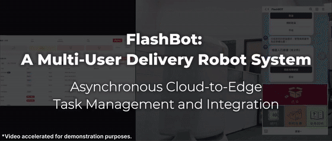
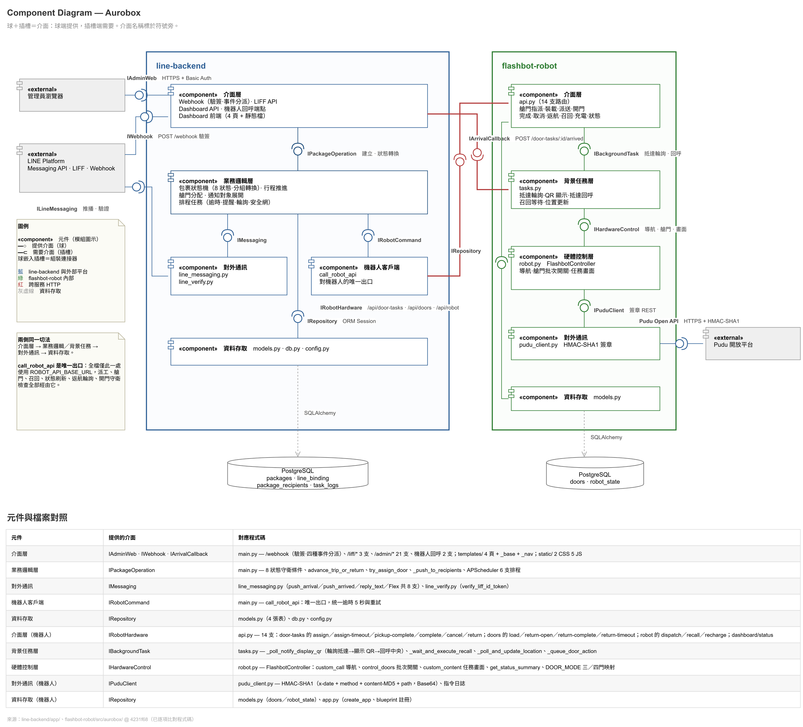

# Flashbot — Autonomous package Delivery for Residential Buildings

A package delivery system built on a Pudu autonomous mobile robot, developed and exercised against physical hardware at Aurotek across 21 days of recorded testing. Residents manipulate via LINE, including receiving arrival notice, scheduling packages, and scanning the QR code on the robot's screen to unlock the cargo door. Building staff register packages, monitor the robot, and resolve exceptions from a web dashboard.

The engineering challenge lies not in delivery itself. In this system, a package can reach multiple final states, including rejection at the door, pickup timeout, resident rejection, emergency recall, expired, dispatch loss, door-assignment loss. Each state has its own transition, timeout and recovery path. When a package reaches its destination state and the robot returns to standby, regardless of the path taken, the delivery is considered successful; rejected packages that have completed the return process are considered successful as well as already picked-up packages. **I tested all branches on physical hardware**, and 92 out of 164 test packages were deliberately delivered to non-nominal paths.

This repository contains a state management layer that maintains consistency under the aforementioned conditions. It includes a single-write package state machine, a coordination loop for resolving failure modes inferred from observable robot states, and an explicit operational path for handling failure modes that cannot be inferred from them. It does not contain any learning components.

---



*package creation → assign doors → loading → dispatch → arrival → QR scan → pickup → return to standby.*

---

## Contribution

Two interns built this system inside a six-person team at Aurotek during July and August 2026. I co-led the project and held sole ownership of `line-backend`.

| Component | Scope |
|---|---|
| **Package state machine** | Eight states across delivery and return flows, covering every exception branch: refusal at the door, pickup timeout, resident decline, robot recall, 72-hour void countdown |
| **LINE integration** | Messaging API v3 — webhook signature verification, Flex Messages, Rich Menu, push notification, 11 conversation entry points across text commands and post-back actions |
| **LIFF applications** | Two embedded web apps: QR pickup, which validates the LIFF ID token against the recipient set before releasing every cargo door under that task, and return request submission |
| **Admin dashboard** | Four pages, 26 authenticated routes — package registration, live robot and cargo-door state, exception resolution, resident binding management, daily reporting with per-package event timelines |
| **Scheduled automation** | Six APScheduler jobs: pickup timeout, door-assignment timeout, return timeout, pickup reminder, return-state coordination, stuck-dispatch recovery |
| **Data model** | Four tables, the grouping-key scheme for multi-package trips, and an append-only event log spanning 53 event types |
| **Integration contract** | The HTTP interface between the two services, specified jointly with my teammate, and all 14 outbound calls into the robot service |

90 commits · 39 source files · 39 HTTP routes · 14 outbound robot calls · 11 LINE entry points · 6 scheduled jobs · 53 event types.

---

## Test Setup and Success Criterion

All tests were conducted in-house at Aurotek, using the physical Pudu robot as the test subject, and test packages and team members as simulated residents. This was integration testing, not field deployment; therefore, all data below should be interpreted as a description of the implementation, not its actual performance in a real building with residents.

The test objective was to cover all branches, not throughput. A test package is considered successful when it reached the endpoint of its assigned branch and the robot returned to standby. If the package was rejected at the cargo door and carried back, it was considered a completed run, not a failure. Therefore, the assignment of abnormal branches was intentionally arranged, and the number was disproportionate to the frequency of occurrence in actual use.

---

## Measurement Basis

All figures derive from the PostgreSQL databases backing the test system. The observation
window runs 2026-07-14 to 2026-08-14, comprising 21 days with recorded activity. The
sampling frame is the complete `packages` table at snapshot time (164 rows) and the
complete `task_logs` table (2,678 rows across 53 event types). `data/packages.json`
contains the raw package export; every derivation appears in
[`docs/metrics.md`](docs/metrics.md).

| Measurement | Value | Nature |
|---|---|---|
| Test packages processed | 164 | Complete `packages` table at snapshot |
| packages routed down a non-nominal branch | 92 of 164 (56.1%) | Test design — deliberate branch coverage |
| Logged events | 2,678 across 53 types | Complete `task_logs` table |
| Robot API call failure rate | 334 of 2,678 events (12.47%) | Property of the test environment, upper bound |
| packages remaining in a non-terminal state | 0 | Observed, confounded — see below |

Three qualifications govern how these should be read.

**The exception share is a test parameter, not an outcome rate.** 56.1% of packages ended
on a non-nominal branch because that is how they were assigned. It carries no information
about how often a delivery would be refused or time out in service.

**The failure rate characterises the test environment, not the system.** It is also an
upper bound: a subset of `*_failed` events record calls the robot executed successfully but
whose response handling or connection timeout logged a failure, and the instrumentation
does not distinguish the two. Separately, 220 of the 334 errors fall on three days when the
robot service was not running. The figure is reported because it sets the conditions the
state layer had to hold under, not as a system characteristic.

**Zero packages in a non-terminal state is a joint result, not evidence of autonomy.** It
follows from a reconciliation loop and 42 manual task deletions acting together. The ratio
between the two is reported in full under [Evaluation](#evaluation).

---

## Problem Statement

A delivery robot in a residential building can end a run in more ways than the nominal one.
The resident is absent. The resident refuses the package at the door. The cargo door reports
occupied while the back end records it empty. The robot reaches standby but the call
announcing arrival is lost in transit. A package sits untouched past its 72-hour window and
must be voided.

Each of those outcomes is a separate branch with its own state transitions, its own
timeout, and its own recovery path, and there are more of them than there are ways for a
delivery to proceed nominally. An implementation that established the nominal path first
and appended error handling afterward would produce a system that demonstrates well and
fails in service. I therefore built the exception branches as first-class flows and
verified each against physical hardware.

The problem I addressed is state consistency: maintaining a single authoritative view of
package state across two services that deploy independently, own separate databases, and
communicate over a link that failed at a measured 12.47% during testing.

---

## System Architecture



| Service | Stack | Responsibility |
|---|---|---|
| `line-backend` | FastAPI · SQLAlchemy · PostgreSQL · APScheduler | Business logic, package state machine, LINE Messaging API, two LIFF apps, admin dashboard, scheduled automation |
| `flashbot-robot` | Flask · PostgreSQL | Pudu AMR hardware control, cargo door management, mission dispatch |

The two services are separated because hardware control exhibits different failure
characteristics and a different deployment cadence from business logic. Isolating them
permits restarting or replacing the robot layer without touching package state. The cost is
structural: two databases, and no database-level mechanism to keep them agreed.

Communication between them is deliberately asymmetric. `line-backend` invokes the robot
service through a single function. The robot initiates contact on exactly one path —
arrival at a resident waypoint. All other state, return detection included, the back end
obtains by polling.

The asymmetry is a delivery-semantics choice. A callback provides at-most-once semantics:
if the message is lost, neither side detects the loss. Polling provides an idempotent
reconciliation channel — a failed cycle is visible on the next one and retries without
coordination between the services. Return detection runs on a poll for precisely this
reason, and that decision is what makes the recovery mechanism described below feasible.

---

## Design

### Single-writer state authority

The robot service reports hardware events — arrival, door actuation, return to standby. It
neither holds nor mutates package status. Every state transition is decided and persisted by
`line-backend`.

The initial implementation did not have this property. Both services maintained parallel
state machines, with the robot holding its own copy of package status. Code review
identified this as a split-brain hazard and the duplicate logic was removed from the robot
side.

The justification is that with two independent databases and no distributed transaction,
permitting both sides to write means a partition or a retry yields two divergent records
with no basis for reconciliation. A single writer gives every anomaly one authoritative
location and gives any repair mechanism an unambiguous target.

The accepted cost is that the robot cannot act autonomously during a partition. I judged a
stalled robot recoverable in a way an inconsistent package record is not.

### Trip grouping under a composite key

packages bound for the same stop share a `door_task_id` derived from
`line_user_id + unit + task_type`. All packages under one key transition as a unit —
arrival, verification, completion, refusal, timeout.

The key resolves two independent problems at two layers.

**Dispatch.** The robot carries several packages and actuates several doors on one trip, so
per-package dispatch returns it to the same unit once per package. Grouping makes the trip
rather than the package the unit of dispatch. Under the test arrival pattern the mechanism
engaged on 106 packages dispatched as 83 trips, with 21 trips carrying more than one package.
That figure confirms grouping fired; it is not an efficiency result, because the arrival
pattern was set by what needed testing rather than by anything representative.

**Pickup identity.** The QR code on the robot's screen originally encoded `package_id`, so a
resident with three packages waiting scanned three times to open three doors in sequence.
Changing the payload to `door_task_id` made one scan release every package under that key at
that stop. This is independent of the dispatch change: grouping determines how many times
the robot stops, the QR payload determines how many times the resident scans, and either
could have been changed without the other.

`task_type` is load-bearing in the key, and deliberately so. Omitting it would merge a
delivery and a return addressed to the same resident into one stop and one scan. Those are
distinct interactions with distinct transition sequences — one releases packages to the
resident, the other accepts packages back — and collapsing them would couple two flows that
differ and leave the resident with no boundary between what they were collecting and what
they were returning. Two scans across a delivery and a return is the intended semantics,
not a missed consolidation.

### A single egress point for robot invocation

All 14 outbound HTTP calls to the robot service route through `call_robot_api`, which owns
timeout, a single retry, and failure logging.

The first implementation invoked the robot directly from each handler, and error handling
diverged between call sites. At the failure rates seen in testing, reimplementing timeout
policy, retry behaviour, and failure logging at 14 sites makes divergence a certainty
rather than a risk.

Consolidating them guarantees that every failure produces a `task_log` entry. That property
is a precondition for the failure analysis reported here.

### Reconciliation bounded by observability

When the robot reaches standby and the reporting call is lost, a scheduled job polls
`/api/dashboard/status`, detects the position change, and writes the missing state. On
2026-07-20 this mechanism repaired 13 packages in a single pass following a sustained
connection failure.

It covers one failure mode. A dispatch or door-assignment call that fails leaves the package
in a non-terminal state from which nothing recovers it. For those cases the dashboard
exposes single-step operator actions — release door, force resolve, redispatch, delete task
— each writing to the event log.

The design objective was full automatic recovery. Implementation established that failure
modes are not homogeneous with respect to observability. "The robot returned without
reporting" is inferable, because robot position is an observable state variable. "The
dispatch call was lost" is not, because no observable variable distinguishes a lost call
from a call never issued. The resulting position was to automate the inferable class and
give the remainder an explicit, auditable manual path, rather than assert a recovery
guarantee the system could not satisfy.

### Fail-fast admission control on cargo doors

Cargo doors are a bounded resource under concurrent contention. Allocation acquires a row
lock with `with_for_update(nowait=True)` and aborts immediately rather than queueing.

A waiting caller holds a database connection and introduces head-of-line blocking for every
request behind it. Immediate refusal permits the caller to retry or surface the condition to
an operator, and keeps the failure observable rather than latent.

---

## Evaluation

### Terminal state distribution

All four outcomes below are completed runs. They differ in which branch the package took,
not in whether the system handled it: in each case the package reached a terminal state, the
cargo door was released, and the robot returned to standby.

| Terminal state | Count | Share |
|---|---|---|
| Collected by resident | 72 | 43.9% |
| Refused at door | 50 | 30.5% |
| Pickup timeout, returned | 33 | 20.1% |
| Declined by resident | 9 | 5.5% |

The distribution reflects deliberate assignment of exception branches for coverage. It is
not an operational outcome rate and should not be read as one.

### Failure distribution

| Error type | Count | Last occurrence |
|---|---|---|
| `assign_timeout_failed` | 116 | 2026-07-27 |
| `cancel_task_failed` | 51 | 2026-08-14 |
| `poll_returned_failed` | 46 | 2026-07-27 |
| `dispatch_failed` | 36 | 2026-07-27 |
| `robot_recall_failed` | 34 | 2026-08-07 |

Failures are temporally clustered rather than uniformly distributed. Three days —
2026-07-20, 07-24 and 07-27 — account for 220 of 334 errors, predominantly HTTP 404
responses from a robot service that was not running. Daily error counts fall to between 0
and 8 after 1 August.

### Operator intervention

| Action | Count |
|---|---|
| Force close case | 82 |
| Delete stuck task | 42 |
| Manually release cargo door | 33 |
| Force resolve | 25 |
| Redispatch | 6 |

This distribution is the denominator behind the zero-stuck-package figure. The ratio of
automated repair to manual intervention is reported rather than omitted because it
constitutes the substantive result.

---

## Threats to Validity

[`docs/known-issues.md`](docs/known-issues.md) contains the complete set, each classified by
whether it was verified against source or against the database.

**External validity — this is in-house testing, not field deployment.** Every run was
conducted at Aurotek with test packages and team members standing in for residents. Nothing
here characterises behaviour with real occupants: not the timeout parameters, not the
refusal handling, not the legibility of the LINE flow to someone encountering it for the
first time. The package distribution is also severely skewed, with a single unit accounting
for 123 of 164 packages, so behaviour under many concurrent distinct destinations is
uncharacterised.

**Construct validity — the failure rate measures logging, not failure.** A subset of
`*_failed` events record calls the robot executed successfully but whose response handling
or connection timeout registered failure. The instrumentation cannot separate the two
classes, so 12.47% bounds the true rate from above by an unquantified margin.

**Internal validity — the zero-stuck result confounds two mechanisms.** Reconciliation and
manual operator intervention both contribute, and the design does not isolate their
individual contributions. The reported intervention counts are the closest available
decomposition.

**Instrumentation — stored timestamps do not encode their own basis.** Both services strip
timezone information before persisting (`.replace(tzinfo=None)`), one storing UTC and one
storing local time. No cross-service comparison exists in current logic, so nothing fails.
The cost was diagnostic: timezone was the leading hypothesis for a set of apparently
inverted timestamps, and the actual cause proved to be the reconciliation loop backfilling
13 records within one second.

**Configuration — degradation is silent.** A door-mapping environment variable that fails
to parse produces a warning and a fallback mapping rather than a startup failure. A
malformed value would disable one cargo door without raising.

---

## Open Problems

Three questions arose from this work that fall outside what I could resolve within it.

The first concerns the boundary between recoverable and unrecoverable failure. The
reconciliation loop repairs a lost return report because robot position is an observable
state variable; it cannot repair a lost dispatch call because no observable variable
distinguishes that case from a call never issued. I established this boundary
case-by-case, by inspection. Whether it admits systematic characterisation — what is
recoverable under partial observability across an unreliable service boundary — is the
problem I would most want to pursue.

The second concerns predictability. The event log holds 2,678 timestamped entries across 53
types, recording every state transition, every failure, and every operator intervention
that followed. Failures are temporally clustered, with three days accounting for two thirds
of them. Whether that record carries sufficient signal to anticipate failure, or to learn a
recovery policy from the interventions operators selected, is a question the data could
plausibly support and that I lack the background to pose rigorously.

The third concerns measurement itself. Integration failure rates for robot systems are
rarely reported. This system measured 12.47% against physical hardware in testing, and that
figure remains contaminated by logging artifacts I could not isolate. Designing
instrumentation that separates genuine failure from artifacts of its recording is a
methodological problem I want to learn to address properly.

These questions are the reason I am applying to graduate study in AI and robotics. The
system described here occupies the layer beneath a learned policy: the component that must
be correct before a policy has dependable state to act on, and the component that determines
whether a robot deployment survives contact with recipients who are absent, refuse packages,
and actuate controls out of order.

---

## Repository Layout

```
.
├── line-backend/          FastAPI service — business logic, LINE, dashboard
│   ├── app/
│   │   ├── models.py      SQLAlchemy models, TaskLog event definitions
│   │   ├── main.py        39 HTTP routes, 6 APScheduler jobs
│   │   └── static/        Dashboard front end
│   └── .env.example
├── flashbot-robot/        Flask service — Pudu AMR hardware control
│   ├── src/aurobox/
│   └── .env.example
├── data/
│   └── packages.json      Raw package export backing docs/metrics.md
├── render.yaml            Deployment blueprint for both services
└── docs/
    ├── architecture.md    Service topology and communication properties
    ├── state-machines.md  Delivery, return, and robot mission flows
    ├── database.md        Data dictionary for all six tables
    ├── api.md             Route inventory grouped by caller
    ├── metrics.md         Derivation of every figure in this README
    ├── known-issues.md    Verified defects and open questions
    ├── diagrams/          Editable draw.io sources
    └── images/
```

## Tech Stack

**Back end** Python · FastAPI · SQLAlchemy · PostgreSQL · APScheduler · Flask
**Messaging** LINE Messaging API v3 SDK · LIFF
**Robot** Pudu Open Platform API
**Infrastructure** Render · Docker

## Running Locally

```bash
cd line-backend
cp .env.example .env        # supply your own credentials
pip install -r requirements.txt
uvicorn app.main:app --reload
```

The robot service requires Pudu Open Platform credentials, which are not included.
`flashbot-robot` starts without them but cannot dispatch a mission.

---

## Author

**Stephanie Lin, Yen Yu** — AI Development Dept. Intern, Aurotek
July – August 2026

Shared for portfolio purposes with permission from Aurotek. Not licensed for reuse.
