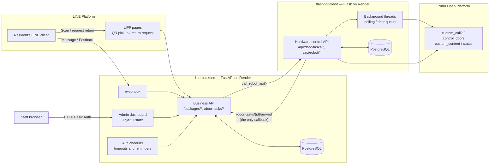

# Architecture

Two independently deployed services with separate PostgreSQL databases, communicating
over HTTP. The split follows the failure characteristics of the work: hardware control
fails differently and deploys on a different cadence than business logic.

## Data flow

## Communication properties

**The link is predominantly one-directional.** `line-backend` calls the robot service;
every such call passes through `call_robot_api()` in `app/main.py`, which owns timeout,
a single retry, and failure logging to `task_log`. The target is configured by
`ROBOT_API_BASE_URL`.

**There is exactly one callback.** After the robot reaches a resident's waypoint,
`_poll_notify_display_qr()` in `src/aurobox/tasks.py` posts to
`{CENTRAL_API_BASE_URL}/door-tasks/{door_task_id}/arrived`. This is the only path by
which the robot service initiates contact with the backend.

**Everything else is polled.** Return detection, robot availability, battery, and position
are obtained by `line-backend` polling the robot's `GET /api/dashboard/status` — the
`poll_robot_returned()` job runs every 20 seconds. The robot does not push these.

The asymmetry is deliberate. A lost callback is a silent failure; a failed poll is
visible on the next cycle and can be retried without coordination. Making return
detection a poll is what allows the compensating recovery described in
[`known-issues.md`](known-issues.md#a-1returned_at-timestamps-appear-inverted).

**Hardware access is isolated.** All robot motion, door actuation, and screen content
reach the Pudu Open Platform REST API through `src/aurobox/pudu_client.py`, authenticated
with HMAC-SHA1 request signing. No other module touches Pudu directly.

## Design principle: one authority for state

The robot service reports hardware events. It does not hold or mutate parcel business
state. Every state transition is decided and written by `line-backend`.

Both teams initially built parallel state machines — the robot service maintained its own
copy of parcel status alongside the backend's. This was identified during a code review
as a data-consistency hazard: with two independent databases, a network partition or a
retry produces divergent records with no basis for deciding which is correct. The
duplicate logic was removed from the robot service.

The cost is that the robot service cannot act autonomously during a partition. That was
accepted: a stalled robot is recoverable, an inconsistent parcel record is not.

## Known deviation

`line-backend/app/main.py` exposes `POST /packages/{package_id}/returned`, but no call
site exists in the current robot service. It appears to predate the move to
`door_task_id` grouping; return detection is now handled by `poll_robot_returned()`.
Likely dead code — confirm before removal.

## Related

- [State machines](state-machines.md) — delivery and return flows with all exception branches
- [Known issues](known-issues.md) — verified defects and open questions
- [Metrics](metrics.md) — measured behaviour of this architecture in deployment
