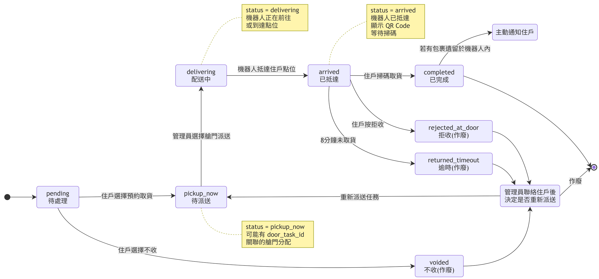
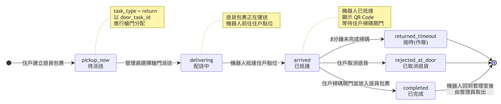
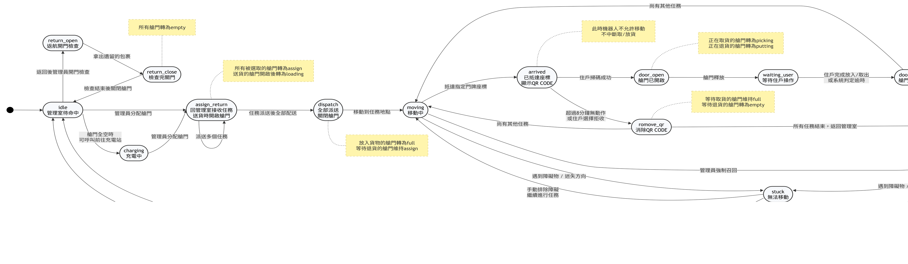

# State Machines

Three views of one system: parcel state under delivery, parcel state under return, and
the robot's physical state. `line-backend` owns the first two. The third is the robot
service's view of its own hardware.

**Source** `技術文件/Diagrams/Package-state-and-Robot-motion_v2.md`
**Editable sources** [`diagrams/`](diagrams/) — open with draw.io

---

## Delivery

**`pickup_now`** may or may not carry a `door_task_id` — the key appears once a door is
assigned, not on entry to the state.

**Scheduled pickup is not a separate state.** `SCHEDULE_PICKUP` writes `pickup_now` and
sets `scheduled_pickup_at`. No `scheduled` value exists in `packages.status`; placement
and dispatch are gated on the timestamp instead.

**`deliver_again` is not a database state.** It represents the operator decision point
after an exception, implemented through the exceptions page rather than as a stored value.

---

## Return

**Returns skip `pending` in practice.** `POST /liff/return-request/submit` writes
`status=pickup_now` directly. The `pending` node is shown for symmetry with the delivery
flow; no return parcel is observed in that state.

**`completed` does not end the workflow.** The parcel is inside the robot. Staff must
open the door, remove it, and close the door — recorded by `return_door_opened_at`,
`return_retrieved_at`, and `door_closed_at` rather than by a status change.

**`CANCEL_RETURN` reuses the refusal path** and lands on `rejected_at_door`, deliberately
suppressing the auto-notification that a delivery refusal would trigger.

---

## Robot mission flow

The hardware's view, maintained by the robot service. Cargo door status transitions are
annotated because they are what the two databases must agree on.

### Cargo door status alongside robot state

| Robot state | Door transition |
|---|---|
| `assign_return` | Selected doors → `assigned`; delivery doors open → `loading` |
| `dispatch` | Loaded doors → `full`; doors awaiting a return stay `assigned` |
| `door_open` | Collecting → `picking`; depositing → `putting` |
| `remove_qr` | Awaiting collection stays `full`; awaiting return → `empty` |
| `door_close` | Collection done → `empty`; return deposited → `full` |
| `return_close` | All doors → `empty` |

The robot does not move while in `arrived`; collection and deposit are never interrupted
by navigation.

---

## Where the two views can disagree

Parcel state lives in `line-backend`; door state lives in `flashbot-robot`. They are
linked only by `door_task_id`, a UUID on one side and a VARCHAR on the other, with no
foreign key, trigger, or consistency check between the two databases.

A failed API call without rollback, or a manual database edit, desynchronises them
**silently** — the divergence surfaces only when the robot opens the wrong door or fails
to open one. This is the constraint that motivated making `line-backend` the sole state
authority; see [`architecture.md`](architecture.md#design-principle-one-authority-for-state)
and [`database.md`](database.md#across-databases).

### Verified deviations from earlier diagram drafts

An earlier version of these diagrams, drawn independently, contained four transitions
that do not exist in code. They are listed because the discrepancy is instructive about
maintaining diagrams alongside an evolving implementation:

1. A `scheduled` state between `pending` and `pickup_now`. `SCHEDULE_PICKUP` writes
   `pickup_now` directly.
2. `pickup_now → voided`. The `REJECT` handler accepts only `status == "pending"`; once a
   parcel reaches `pickup_now`, declining is no longer available.
3. A `pending` stage in the return flow. Return parcels are created at `pickup_now`.
4. Terminal states ending the flow. `rejected_at_door` and `returned_timeout` are not
   endpoints — the parcel still travels back, is retrieved by staff, and is then closed
   or redispatched.
